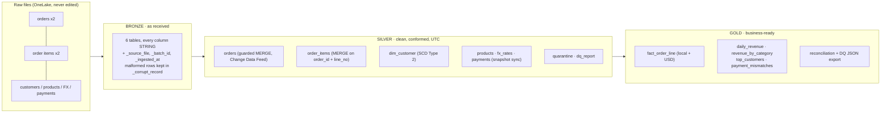

# NovaCart Order Analytics: Medallion Pipeline on Microsoft Fabric

A **bronze → silver → gold** data pipeline that turns NovaCart's raw September 2026 order files into one trusted set of
revenue numbers for Finance. It runs on **Microsoft Fabric** (OneLake lakehouses, Delta Lake, Fabric Spark and Data
Pipelines), and it gives the **right answer after batch 1, after batch 2, and when either batch is accidentally run
twice**.

Built by **Team Bug Byts** for the *NovaCart Order Analytics: Data Engineering Lab* (HCLTech AI-Ready Cloud Data
Engineer programme).

| | |
|---|---|
| **Start here** | [Design note (1 page)](docs/NovaCart_Design_Note.pdf) · [Cheatsheet (2 pages)](docs/NovaCart_Pipeline_Cheatsheet.pdf) |
| **Deliverables** | [Deliverables PDF](deliverables/NovaCart_Deliverables.pdf) (pipeline export, monitored runs, DQ report, evidence) · [Evidence write-up](evidence/EVIDENCE.md) |
| **Submission** | [SUBMISSION.md](SUBMISSION.md) (checklist, test results, AI-use disclosure) · [CONTRIBUTIONS.md](CONTRIBUTIONS.md) |

---

## Contents

1. [The problem](#1-the-problem)
2. [Architecture](#2-architecture)
3. [Technology choices](#3-technology-choices)
4. [How each layer works](#4-how-each-layer-works)
5. [Correct after every batch and every re-run](#5-correct-after-every-batch-and-every-re-run)
6. [Results](#6-results)
7. [Testing](#7-testing)
8. [Repository layout](#8-repository-layout)
9. [How to run](#9-how-to-run)
10. [Security and cost](#10-security-and-cost)
11. [Assumptions](#11-assumptions)
12. [Lessons learned](#12-lessons-learned)
13. [AI assistance and contributions](#13-ai-assistance-and-contributions)

---

## 1. The problem

NovaCart sells in India, the US, the UK, Germany and Singapore, and Finance was getting different revenue numbers from
different spreadsheets. Order data arrives in **two batches**:

- **Batch 1** covers 1–15 September.
- **Batch 2** arrives later, with new orders **and corrected versions of earlier orders**. Some of those corrections are
  older copies that must *not* overwrite newer data.

The pipeline must therefore be **incremental**, **late-data safe** and **idempotent**. The eight input files may never
be edited by hand: every fix happens in code.

| File | Format | Nature |
|---|---|---|
| `orders_batch_1.csv`, `orders_batch_2.csv` | CSV | Incremental order versions |
| `order_items_batch_1_json.txt`, `order_items_batch_2_jsonl.txt` | JSON Lines | Incremental order lines and returns |
| `customers_changes.csv` | CSV | CRM: one row per customer profile version |
| `products.csv`, `fx_rates.csv` | CSV | Catalogue snapshot; daily FX rates (business days only) |
| `payments_json.txt` | JSON array (multi-line) | Full payment snapshot |

Profiling the real data before writing any pipeline code showed what had to be handled:

- 10 late batch-2 rows are older *paid* copies of orders that batch 1 already marked *cancelled*.
- 236 `+05:30` timestamps fall on the previous day in UTC.
- 435 `dd/MM/yyyy` dates have a day of 12 or less, so a month-first parser would be silently wrong.
- There are orphan order lines, unknown products, CRM rows without `updated_at`, customers missing from the CRM,
  FX gaps on weekends and holidays, and duplicate rows in every batch.

## 2. Architecture



**Orchestration**: one Fabric Data Pipeline, `novacart_medallion`, with a `batch_id` parameter:

```
setup → bronze → silver_reference → silver_orders → silver_items → gold
                                                                     │  Failed or Skipped
                                                          notify_failure → fail_run
```

Every step retries twice, 60 seconds apart. If any step fails, the steps after it are skipped. `notify_failure` then
records an alert (a table row and a JSON file), and `fail_run` marks the run Failed, so a failure is never hidden.

## 3. Technology choices

| Lab requirement | Fabric feature | Why |
|---|---|---|
| Storage for raw files and tables | **OneLake lakehouses**: `LH_NovaCart_Bronze`, `_Silver`, `_Gold` | One lakehouse per layer, Delta tables under `dbo` |
| Upserts, change history, point-in-time reads, schema enforcement | **Delta Lake** | `MERGE`, `DESCRIBE HISTORY`, `VERSION AS OF`, NOT NULL + CHECK constraints, Change Data Feed |
| Distributed processing | **Fabric Spark** notebooks (PySpark + Spark SQL) | Scales out; a small F2 capacity is enough for the lab |
| Parameters, retries, failure path | **Fabric Data Pipelines** | `batch_id` parameter, per-step retry policy, Failed/Skipped dependencies, run monitoring |
| Security | **Microsoft Entra ID** and workspace roles | No keys, tokens or secrets anywhere |

Microsoft Fabric was chosen after the original Azure Databricks plan was blocked: the student subscription was
disabled, and the trial account could not grant storage roles. Databricks Free Edition and AWS/GCP were also
considered. Because Fabric tables are Delta, the Spark code stays close to the original Databricks design.

## 4. How each layer works

**Bronze** (`01_bronze`) loads every file *exactly as received*:
- Every column is stored as STRING, so nothing is converted or lost.
- Lineage columns are added: `_source_file`, `_batch_id`, `_ingested_at`.
- A malformed record is kept in `_corrupt_record` instead of failing the load.
- Each write **replaces only its own file's rows** (`replaceWhere _source_file = …`). Re-running a batch therefore
  changes nothing, and a snapshot re-delivered in batch 2 replaces batch 1's copy instead of duplicating it.

**Silver** (`03_silver_reference` → `02_silver_orders` → `04_silver_items`, with the logic in `lib_silver`):
- **Timestamps:** three formats are parsed explicitly and converted to **UTC**. `order_date` is the UTC date.
- **Currency:** codes are upper-cased; a blank code is derived from the shipping country.
- **Quarantine:** every rejected row goes to `silver.quarantine` with a **specific reason** and its **original
  record**. Reasons include `ORDER_TS_INVALID`, `STATUS_INVALID`, `CURRENCY_UNRESOLVED`, `ORDER_NOT_FOUND` and
  `UPDATED_AT_MISSING`.
- **Deduplication:** within a batch, the latest `updated_at` wins. Exact duplicates collapse, and ties are broken by
  row content, so the result never depends on row order.
- **Orders** are `MERGE`d with a guard: a row is replaced only by a **newer** version.
- **Order lines** are keyed on `(order_id, line_no)`. Returns are forced to negative quantity, and unknown products load
  with a flag.
- **Customers** are an **SCD Type 2** dimension. A new version starts only when *tier* or *country* changes; name and
  e-mail are Type 1. The surrogate key is a stable hash.
- **Snapshot tables** (products, FX rates, payments) are synced: only changed rows are touched, so reloading an
  unchanged snapshot writes no commit.
- **`silver.dq_report`** records rows in / out / quarantined / deduplicated for every step. It refuses to write unless
  they balance.

**Gold** (`05_gold`, with the logic in `lib_gold`) is a deterministic full rebuild from silver:
- **`fact_order_line`:** local and USD amounts per order line.
  - FX uses the **as-of rate**: the order date's rate, or the latest earlier one; USD = 1.
  - Each line joins the customer version valid **at the order time** (a point-in-time join).
  - A revenue flag marks paid / shipped / delivered orders.
- **Business tables:** `daily_revenue`, `revenue_by_category`, `top_customers` (top 10, excluding unknown customers) and
  `payment_mismatches`. An order is flagged when the net of successful payments minus refunds differs from the expected
  amount by **more than 0.50**.
- **`reconciliation`:** the same revenue measured three ways must agree to the cent.
- **DQ export:** each batch's report is exported as JSON.

## 5. Correct after every batch and every re-run

Two examples from the real data:

| Order | Batch 1 | Batch 2 | Outcome |
|---|---|---|---|
| NC-100473 | *paid*, updated 15 Sep | *delivered*, updated 19 Sep | **Updated**: newer wins |
| NC-100276 | *cancelled*, updated 10 Sep | late copy, *paid*, updated 9 Sep | **Ignored**: an older copy can't overwrite |

`silver.orders` history after the official runs:

| Version | Operation | Batch | Inserted | Updated |
|---|---|---|---|---|
| 0–2 | create + constraints | setup | | |
| **3** | MERGE | batch 1 | 495 | 0 |
| **4** | MERGE | batch 2 | 450 | 137 |
| none | — | **batch 2 again** | 0 | 0 |

The re-run made **no new version**: the MERGE found nothing newer, and Delta writes no commit for a MERGE that changes
nothing. `SELECT * FROM silver.orders VERSION AS OF 3` returns the table exactly as it was after batch 1.

## 6. Results

Final state, after both batches:

| Measure | Value |
|---|---|
| Orders / order lines | 945 / 1,933 |
| Final status mix | delivered 666 · cancelled 107 · shipped 89 · placed 44 · paid 39 |
| Customer versions (SCD2) | 166 for 130 customers, plus the unknown member (-1) |
| **Revenue** | **$295,585.57** over 30 days (after batch 1 alone: $150,062.64 over 15 days) |
| Top category | Electronics, $223,943.51 |
| Top customer | C0035, $20,337.77 |
| Payment mismatches | 13 orders (5 payments for unknown orders counted separately) |
| Quarantined | 5 CRM rows without `updated_at`; 10 + 8 order lines with no matching order |

**Every gold number equals an independent plain-Python calculation, to the cent.** That calculation is
[`tests/local/reference_totals.py`](tests/local/reference_totals.py), which reads the original files without Spark. It
was checked both for the state right after batch 1 (read with Delta time travel) and for the final state.

## 7. Testing

The tests follow a 52-case matrix covering bronze, silver, customers, gold, orchestration, reliability and data
quality. It's defined in [the master build prompt](docs/prompts/master_build_prompt.md). Each module has a test notebook
under [`notebooks/tests/`](notebooks/tests), run on Fabric.

| Module | Covers | Result |
|---|---|---|
| Config + setup | Timestamp formats, the UTC date boundary, currency rules, constraints, idempotent setup | all pass |
| Bronze | Row counts, lineage, values as received, re-run, malformed line, snapshot loaded once | all pass |
| Silver orders | Late data, re-run, batch 2 then 1 = batch 1 then 2, quarantine reasons | all pass |
| Items, SCD2, reference | Orphans, returns, discounts, corrections, SCD2 integrity, point-in-time | 38 / 38 |
| Gold | Weekend FX, the 0.50 boundary, returns on the order date, reconciliation, Python reference | 29 / 29 |
| Pipeline | Deliberate failure (`batch_id = abc`), official runs, time-travel verification | 25 / 25 |
| Evidence | History, time travel, schema enforcement, CHECK, OPTIMIZE, VACUUM, CDF, incremental gold | 11 / 11 |

Edge cases the real data doesn't contain are tested with **data generated by code**, because the real inputs may not
be edited. These include malformed JSON, unknown status, an unmappable country, `UK`, a corrected order line, timestamp
ties and an order before the first FX rate.

## 8. Repository layout

```
notebooks/
  00_config.py            names, paths, business constants, shared helpers (parse_ts, quarantine, DQReport)
  00_setup.py             silver DDL: NOT NULL + CHECK constraints, Change Data Feed, unknown customer
  01_bronze.py            raw files → bronze (STRING + lineage, re-run safe)
  03_silver_reference.py  products, fx_rates, payments, dim_customer (SCD2)
  02_silver_orders.py     orders: parse, quarantine, dedup, guarded MERGE
  04_silver_items.py      order lines: orphans, returns, unknown products, MERGE
  05_gold.py              fact + business tables, reconciliation, DQ export
  lib_silver.py           silver transformations as testable functions
  lib_gold.py             gold transformations as testable functions
  99_notify_failure.py    the pipeline's on-failure step
  06_evidence.py          Part 5 / Part 6 evidence on the official tables
  98_reset_lab.py         drop lab tables before official runs (needs confirm=RESET)
  tests/                  test notebooks for Modules 2–7
pipeline/novacart_pipeline.json   pipeline source: steps, retries, failure path
setup/                    deploy and run tools (lakehouses, notebooks, pipeline, exports, teardown)
tests/local/              independent plain-Python reference calculation
evidence/                 run logs of every monitored run + EVIDENCE.md
deliverables/             NovaCart_Deliverables.pdf + raw exports (pipeline definition, runs, DQ JSON)
docs/                     design note, cheatsheet, their generators, and the master build prompt
```

## 9. How to run

Prerequisites: the Azure CLI, signed in with `az login` to the account that has access to the `NovaCart_HCL`
workspace; Python 3; and the Fabric capacity resumed.

```bash
python3 -u setup/run_fabric_notebook.py notebooks/00_config.py 00_config --lakehouse LH_NovaCart_Silver --no-run
#   (repeat for each notebook in notebooks/, or redeploy only what changed)
python3 -u setup/pipeline_tool.py deploy        # create/update the Data Pipeline from pipeline/novacart_pipeline.json
python3 -u setup/pipeline_tool.py run 1         # run batch 1, wait, save the step-by-step log to evidence/run_logs/
python3 -u setup/pipeline_tool.py run 2         # run batch 2
python3 tests/local/reference_totals.py <folder with the input files> 1,2    # expected numbers, plain Python
setup/teardown.sh pause                         # pause the capacity afterwards
```

Run monitoring is in the Fabric portal: **Monitor → `novacart_medallion` → View run details**.

## 10. Security and cost

- **No secrets anywhere.** All access uses Entra ID sign-in. Scripts borrow a short-lived token from `az` at run time
  and never store it. `.gitignore` blocks `.env`, keys and credential files.
- **The input files are never committed.** They stay in OneLake and on the data owner's machine.
- **Cost:** the F2 capacity bills only while resumed (about $0.36/hour). It was resumed only while running and paused
  straight after, which came to roughly $2–3 of credit for the whole build.

## 11. Assumptions

These are where the spec was unclear; the [design note](docs/NovaCart_Design_Note.pdf) has the full table.

- A timestamp with no offset is UTC. `order_date` is the UTC date.
- With the same `updated_at`, the later batch wins only if the content differs. Running batch 2 then batch 1 therefore
  gives the same result as batch 1 then batch 2.
- FX uses the order date's rate, or else the latest earlier rate. USD = 1. An order with no rate at all is flagged
  `fx_missing`, excluded from revenue and counted.
- Returns are forced to negative quantity and dated by their parent order. A NULL discount means 0.
- Payment mismatch: the expected amount is the order total if the order is paid / shipped / delivered, and 0
  otherwise. Payments for unknown orders are kept, excluded from the comparison and counted.
- The payments file is a full-month snapshot. So after batch 1 it already contains payments for orders that only
  arrive in batch 2: 64 mismatches then, 13 at the end.

## 12. Lessons learned

- **No-op MERGEs leave no trace in history.** Re-runs are proven by the unchanged version number and the DQ report,
  not by a new commit.
- **Fabric specifics:**
  - A child notebook must share its parent's default lakehouse.
  - `notebookutils.fs.head` stops at about 100 KB.
  - `try_to_date` doesn't exist in Fabric's Spark 3.5.
  - Delta `DELETE` doesn't accept subqueries.
  - `count()` can be answered from Delta statistics without reading any file.
- **Generic failure messages hide the real error**, so every test saves a PASS/FAIL list with the actual error to a
  results file.
- **An independent reference calculation** caught nothing wrong, and that's the point: it's what makes "the numbers
  are right" a demonstrated fact rather than a claim.

## 13. AI assistance and contributions

The code, tests and documents were generated with **Claude (Anthropic)**, through Claude Code, under the team's
direction. Every module was reviewed and verified by real test runs before the next one started.
[SUBMISSION.md](SUBMISSION.md#ai-assistance-disclosure-lab-ground-rule) lists, per module, what was generated, how it
was validated and which decisions were human. Individual contributions are in [CONTRIBUTIONS.md](CONTRIBUTIONS.md).
